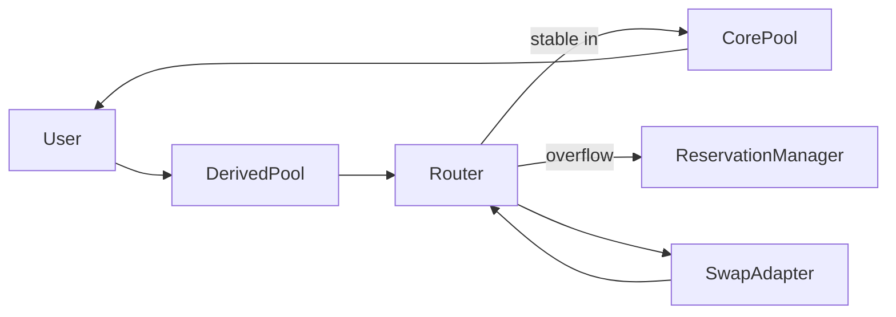

# RWA Liquidity Hub (Hackathon MVP)

단일 RWA/Stable 실물 풀로 모든 파생 현물(spot) 마켓을 구동합니다. 가격은 오라클 없이 Virtual Reserve AMM으로 형성되며, 체결량은 실재고로 캡됩니다. 초과 수요는 Reservation으로 전환되어 사용자가 나중에 취소하거나 클레임할 수 있습니다.

## 왜 필요한가
전통적인 AMM은 깊은 유동성과 빠른 가격 발견을 전제로 합니다. 반면 RWA는 공급이 제한적이고 가격 안정성이 높아 동일한 슬리피지를 감내하기 어렵습니다. 이 불일치는 거래를 저해하고 발행자의 유동성 공급을 꺼리게 만듭니다. 이 MVP는 단일 실물 풀 + 가상 리저브 가격곡선 + 예약 큐로 이 문제를 풀어냅니다.

## 구성 요약
- RWA <-> Stable 가격을 형성하는 Core Virtual Reserve 풀
- 실재고 캡과 예약 전환을 처리하는 Router
- 파생 페어를 무한히 확장하는 Derived Spot Pool
- Quotes/풀 상태/관리자 액션을 제공하는 Backend API
- 스왑/예약/클레임을 시연하는 Frontend 데모

## 풀 라이프사이클
- 풀 만기: 배포 시점 + 6시간 (만기 이후 swap 불가)
- 최초 유동성은 생성자가 RWA totalSupply의 2% 이상 + stable > 0로 제공해야 함
- 최초 유동성 이후에는 누구나 입출금 가능, 단 생성자는 만기 전 출금 불가
- 가상 리저브는 초기 가격 비율을 유지하면서 변동폭이 ±30%를 넘지 않도록 자동 계산
- 예약(quote) 대기열은 유동성 투입 후 `processQueue`로 우선 처리, 만기 이후에는 purge로 소멸

## 아키텍처


## 문서
- `docs/README.md` (GitBook 홈)
- `docs/SUMMARY.md` (GitBook 네비게이션)
- `docs/user-guide.md` (프로젝트 소개 + 사용자 인터랙션)
- `docs/protocol-guide.md` (프로토콜 설명 + 아키텍처 + 사용자/LP 함수 정리)
- `docs/protocol.md` (프로토콜 규칙 + 프론트 연동 함수 목록)

## 컨트랙트 (Foundry)
- `contracts/src/CoreVirtualReservePool.sol`
- `contracts/src/ReservationManager.sol`
- `contracts/src/LiquidityHubRouter.sol`
- `contracts/src/DerivedSpotPool.sol`
- `contracts/src/DerivedSpotPoolFactory.sol`
- `contracts/src/MockSwapAdapter.sol` (demo 전용)
- `contracts/src/MockERC20.sol` (demo 전용)

### 배포 (로컬 또는 테스트넷)
```bash
cd contracts
forge build
forge script script/Deploy.s.sol:Deploy --rpc-url $RPC_URL --private-key $PRIVATE_KEY --broadcast
```

배포 후 `shared/addresses.json`에 주소를 업데이트하세요.

## Backend
위치: `backend/`

```bash
cd backend
cp .env.example .env
npm install
npm run dev
```

주요 환경 변수:
- `RPC_URL`
- `ADMIN_PK` (옵션)
- `ADDRESSES_JSON=../shared/addresses.json`

엔드포인트:
- `GET /pool`
- `GET /quote?tokenIn=...&amountIn=...`
- `GET /reservation/:user`
- `POST /admin/virtual-reserves`
- `POST /admin/fee`
- `POST /admin/adapter`

## Frontend
위치: `frontend/`

```bash
cd frontend
cp .env.example .env
npm install
npm run dev
```

Frontend에서 필요로 하는 것:
- `shared/addresses.json` 업데이트
- `VITE_API_URL` (기본값 `http://localhost:8787`)

## Demo Flow
1. 데모 토큰 민팅 및 풀 시딩 (see `contracts/script/Deploy.s.sol`).
2. WETH -> Stable 어댑터 레이트 설정 (MockSwapAdapter).
3. Stable 또는 WETH로 RWA 스왑.
4. 캡이 걸리면 초과분은 예약으로 전환.
5. RWA 유동성을 추가한 뒤 예약 물량 클레임.

## 외부 입력/의존성
- RPC provider (Alchemy, Infura, 또는 로컬 노드)

오라클 피드는 사용하지 않습니다. 가격은 Virtual Reserve AMM으로 형성됩니다.

## 다음 단계
- Router 내부 Circuit Breaker 모듈
- FIFO 예약 큐
- 실제 WETH -> Stable 라우팅을 위한 Uniswap 어댑터
- 공유 Router 기반의 멀티-RWA 지원
