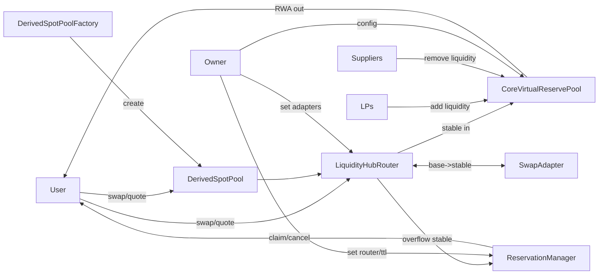

# RWA Liquidity Hub 프로토콜 설명서

## 개요
이 프로토콜은 단일 RWA/Stable 풀을 중심으로 **가상 리저브(Virtual Reserves)**로 가격곡선을 만들고, **실제 재고(Real Reserves)**로 체결량을 제한합니다. 초과 수요는 예약(Reservation)으로 전환되어, 유저가 나중에 클레임하거나 취소할 수 있습니다. 스왑의 단일 진입점은 Router이고, 파생 페어는 얇은 래퍼(Derived Pool)로 확장됩니다.

핵심 아이디어:
- 가상 리저브 AMM으로 가격 형성(오라클 없음)
- 실제 재고를 초과하는 체결은 금지(캡 적용)
- 초과분은 ReservationManager에 Stable로 예약

## 핵심 구성 요소
- `CoreVirtualReservePool`: RWA/Stable 상수곱 가격곡선, 수수료, 실재고 캡 적용
- `LiquidityHubRouter`: 스왑 오케스트레이션, 어댑터 연동, 예약 처리, 사용자 진입점
- `ReservationManager`: 예약 Stable 보관/취소/클레임
- `DerivedSpotPool`: UI/UX용 얇은 래퍼(무한 파생 페어 제공)
- `DerivedSpotPoolFactory`: baseToken별 DerivedSpotPool 생성

## 아키텍처

## 스왑 유저 인터랙션

### 조회(view) 함수
- `DerivedSpotPool.quoteExactIn(amountIn)`
  - 사용처: UI에서 특정 baseToken 스왑 예상 수령량 미리보기
  - 내부 동작: Router의 `quoteToRwaExactIn` 호출로 위임
- `LiquidityHubRouter.quoteToRwaExactIn(tokenIn, amountIn)`
  - 사용처: baseToken -> stable 변환(어댑터) + CorePool 캡 계산
  - 반환값: `rwaOutQuote`(이론치), `rwaOutCap`(실재고 한도), `stableAmount`, `willReserve`
- `CoreVirtualReservePool.quoteExactIn(tokenIn, amountIn)`
  - 사용처: Router 내부에서 실제 가격곡선과 실재고 캡 계산
  - 반환값: `amountOut`, `maxFillOut`, `priceImpactBps`

참고: 외부에 공개된 `pure` 함수는 없고, 내부 보조 함수만 `pure/view`로 동작합니다.

### TX 함수
- `DerivedSpotPool.swapExactIn(amountIn, minOut, to, allowReserve)`
  - 사용처: 유저가 실제 스왑 호출(UX 진입점)
  - 내부 동작: Router의 `swapToRwaExactIn` 호출로 위임
- `LiquidityHubRouter.swapToRwaExactIn(tokenIn, amountIn, minRwaOut, recipient, allowReserve)`
  - 사용처: 실제 스왑 오케스트레이션
  - 동작 요약: 어댑터로 stable 확보 → Core에 스왑 → 초과분 예약/환불
- `LiquidityHubRouter.claimReservation(minRwaOut, recipient)`
  - 사용처: 예약된 Stable로 추후 RWA 체결
- `LiquidityHubRouter.cancelReservation()`
  - 사용처: 예약된 Stable 취소 및 환불

참고: `CoreVirtualReservePool.swapExactIn`은 Router만 호출 가능(유저 직접 호출 불가)입니다.

## 유동성 공급자(코어 풀) 인터랙션

### 조회(view) 함수
- `CoreVirtualReservePool.getRealReserves()`
  - 사용처: 실제 RWA/Stable 재고 확인
- `CoreVirtualReservePool.getEffectiveReserves()`
  - 사용처: 가상 리저브 포함 가격곡선 파라미터 확인
- `CoreVirtualReservePool.getVirtualReserves()`
  - 사용처: 설정된 가상 리저브 확인
- `CoreVirtualReservePool.feeBps`, `vRwa`, `vStable`, `router`
  - 사용처: 풀 파라미터 확인

### TX 함수
- `CoreVirtualReservePool.addLiquidity(rwaAmount, stableAmount)`
  - 사용처: 풀 유동성 공급(입금)
- `CoreVirtualReservePool.removeLiquidity(rwaAmount, stableAmount, to)`
  - 사용처: 유동성 회수(출금)
  - 제한: `suppliers`로 등록된 주소만 가능

## (선택) Derived Pool 생성자 인터랙션

### 조회(view) 함수
- `DerivedSpotPoolFactory.getDerivedPool(baseToken)`
  - 사용처: baseToken에 대한 파생 풀 존재 여부 확인
- `DerivedSpotPoolFactory.allPoolsLength()`
  - 사용처: 전체 파생 풀 개수 확인

### TX 함수
- `DerivedSpotPoolFactory.createDerivedPool(baseToken)`
  - 사용처: baseToken별 파생 풀 생성

## 파일 레퍼런스
- `contracts/src/CoreVirtualReservePool.sol`
- `contracts/src/LiquidityHubRouter.sol`
- `contracts/src/ReservationManager.sol`
- `contracts/src/DerivedSpotPool.sol`
- `contracts/src/DerivedSpotPoolFactory.sol`
- `contracts/src/interfaces/ISwapAdapter.sol`
